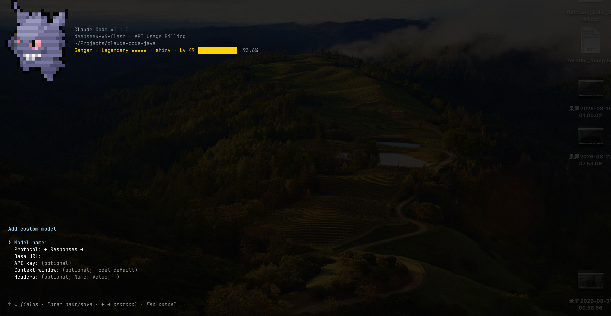
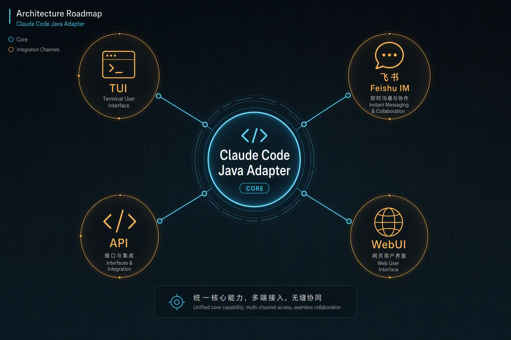
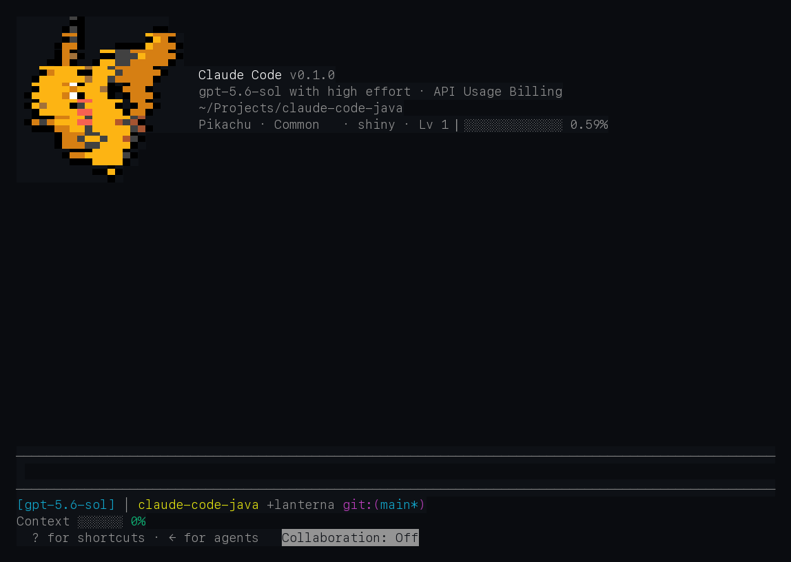
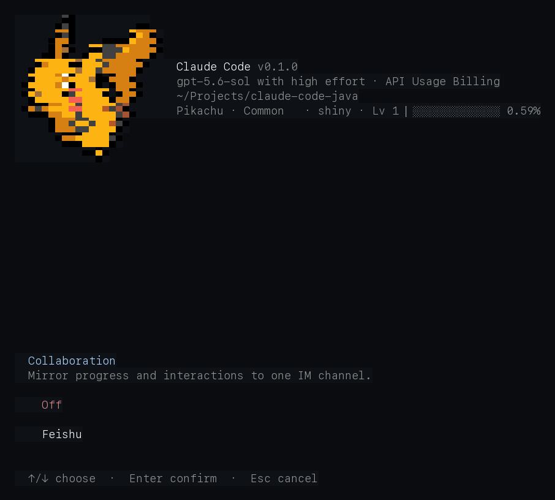
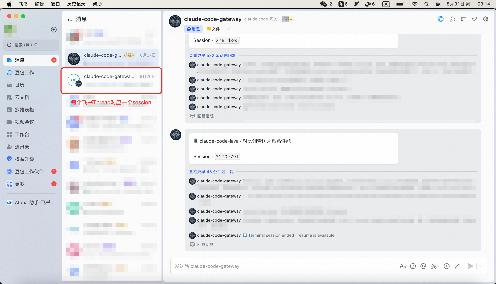
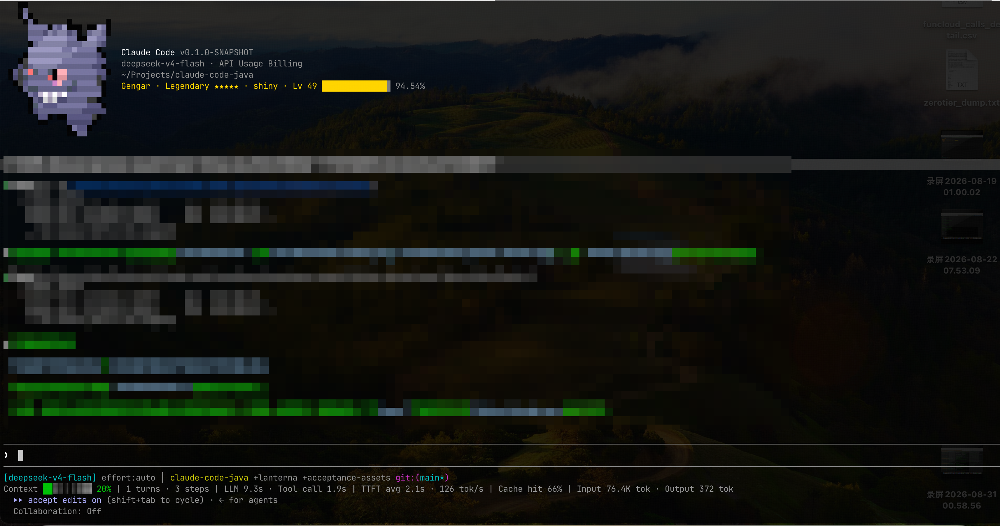

<h1 align="center">claude-code-java</h1>
<h6 align="center"><sub><small>a modern Java 25 harness, still evolving</small></sub></h6>

<p align="center">
  
  
  
</p>

> A claude code harness agent implemented in modern Java 25.

> **🌐 Language:** [English](README.en.md) | [中文](README.md)

## Overview

Provides **baseline capability** close to the official 2.1.197 release — conversation,
tool invocation, permissions, session management, and a terminal experience — with
more new features **continuously being added**.

## What can go beyond?

> The areas where claude-code-java aims to exceed the official release in ease of use.

### 1. Built-in model routing

Built-in model routing configuration. For users who don't want the heavyweight
cc-switch solution, it natively supports `chat` / `response` / `message` protocol
compatibility.



### 2. Built-in Feishu (Lark) connect capability

Provides **TUI-level connect** — associate a Feishu Thread directly inside a running
claude code java process, with clear session management and what-you-see-is-what-you-get.
Unlike traditional cc-connect solutions that must run non-interactively via the agent SDK.

> 🎯 Outlook: currently supports only the TUI/IM surface. We believe a good Harness
> should be surface-agnostic, and plan to support common API, web UI, and desktop in
> the future.
> We also believe a good Harness should expose its capabilities as a white-box API,
> rather than hiding all the logic inside a binary like the claude code SDK.


<p align="center"><sub>▲ Concept outlook diagram (via. gpt-image-2)</sub></p>








### 3. Built-in HUD

Real-time awareness of model usage and various monitoring data — so your context
anxiety is handled for you.



### 4. Pokemon system

Upgrade your buddy into a Pokemon system — **38 kinds of Pokémon to gacha**.

<video src="docs/acceptance-assets/pokemon-hatch-evolve.mp4" controls style="max-width: 100%;"></video>

### 5. Project menu and cross-project resume

The official resume picker is a **flat list of sessions within one project**, and it
**refuses cross-directory resumes** outright — picking another project only prints a
`cd … && claude --resume …` hint and leaves you to start a new process yourself.

We turned it into a left-docked **project drawer** (a Codex-desktop-style two-level
project → session tree): opened by the leftmost footer button, by click, or by `/project`;
`↑/↓` walks rows, `→/←` expands and collapses, `Enter` resumes, `x` arms a two-stage
delete, and `Space` opens a wide scrollable transcript preview driven by the same
rendering pipeline the resume picker uses — so a skimmed session looks exactly like the
session it will become. The project index is backed by a **fingerprint-validated
persistent cache** (file count + newest mtime): unchanged directories are served from
cache, and a changed directory rescans only itself, so hundreds of sessions stay snappy.

More importantly, **cross-project resume is a real in-process switch**: `user.dir`, the
QuerySession working directory, and the project identity (which selects the transcript
directory, the settings tiers, the project-scoped `CLAUDE.md`, and the permission root)
are all repointed together, and the transcript recorder, permission root, git-status
snapshot, and settings watcher are rebuilt. The switch is two-phase — the prepare phase
runs on a virtual thread, validates the target directory, and only stages; the apply
phase commits on the UI thread — so **an aborted resume leaves the outgoing project
untouched**.

> Known limits (deliberately deferred, not papered over): project-scoped MCP servers keep
> the outgoing project's connections, LSP roots are not restarted, and plugin/skill
> discovery is not rescanned.

## Architecture

```
┌─────────────────────────────────────────────────────────────┐
│                claude-code-cli (Picocli)                    │
│                 App entry / CLI parsing / composition root   │
│  claude-code-sdk: separate JVM query transport + in-process SDK MCP │
├─────────────────────────────────────────────────────────────┤
│                  claude-code-ui (Lanterna)                  │
│    Terminal UI: REPL, message rendering, input, Vim mode, Markdown │
├──────────────────┬──────────────────┬───────────────────────┤
│  claude-code-    │  claude-code-    │  claude-code-         │
│  commands        │  tools           │  services             │
│  slash commands  │  tool system     │  compact/hooks/memory  │
├──────────────────┴──────────────────┴───────────────────────┤
│                  claude-code-runtime                        │
│    QuerySession │ turn/session orchestration │ ports       │
├─────────────────────────────────────────────────────────────┤
│                   claude-code-core                          │
│  Protocol │ Message │ Value Object │ Pure Policy │ Config   │
├──────────────────┬──────────────────────┬───────────────────┤
│  claude-code-api │  claude-code-mcp     │  claude-code-lsp   │
│  model routing   │  MCP client          │  Language Server    │
│  + 3 protocols   │                      │   Protocol          │
│  custom routing  │                      │                     │
│  Anthropic/OpenAI│                      │                     │
├──────────────────┴──────────────────────┴───────────────────┤
│                   claude-code-http                          │
│            shared OkHttp transport (api / mcp / lsp)         │
├─────────────────────────────────────────────────────────────┤
│  claude-code-session │ claude-code-permissions              │
│        session persist │          permission engine          │
└─────────────────────────────────────────────────────────────┘
```

| Module | Description |
|--------|-------------|
| `claude-code-core` | Stable model protocols, message system, pure policies & value objects |
| `claude-code-http` | Shared OkHttp transport (api / mcp / lsp) |
| `claude-code-api` | Model routing + 3 protocols (Anthropic / OpenAI Chat / OpenAI Responses) + Vertex, Bedrock adapters |
| `claude-code-permissions` | Permission system (allow/deny/ask) |
| `claude-code-runtime` | Query/session transaction orchestration & ports (the hub) |
| `claude-code-tools` | Tool system (tool implementations + support classes) |
| `claude-code-commands` | Slash command system + command adapters |
| `claude-code-mcp` | Model Context Protocol integration |
| `claude-code-session` | Session management (JSONL persistence) |
| `claude-code-services` | Service layer: compact, hooks, memory, etc. |
| `claude-code-ui` | Terminal UI: renderer, dialogs, menus, Vim mode |
| `claude-code-lsp` | Language Server Protocol integration |
| `claude-code-cli` | CLI entry point & composition root |
| `claude-code-sdk` | Out-of-process Agent SDK, control protocol & in-process SDK MCP server |
| `claude-code-app` | App packaging & distribution |

### Dual launch: JVM & native binary

The whole project is developed on **Java 25** and supports two runnable forms: as a
fat JAR on the JVM, or compiled as a **GraalVM native binary**.

| Aspect | JVM fat JAR | GraalVM native binary |
|--------|-------------|------------------------|
| Launch | `java -jar claude-code-app.jar` | execute the compiled binary directly |
| Startup | < 2s | < 500ms |
| Use case | everyday dev, fast iteration, debugging & logs | sub-second startup, scripting, CI integration |
| Artifact | fat JAR with all deps | platform-bound standalone executable |

The native binary offers three build tiers:

- `nativeQuickCompile` (`-Ob`): full features, low build cost, for daily verification
- `nativeCompile` (GraalVM default `-O2`): for performance bench & throughput regression
- `nativeReleaseCompile` (`-Os`): prioritizes final size, for official releases

## Tech stack

| Category | Tech |
|----------|------|
| Language | Java 25+ (Records, Sealed Classes, Pattern Matching, Virtual Threads) |
| Build | Gradle 9.7 + Kotlin DSL |
| JSON | Jackson 2.18.9 |
| HTTP | OkHttp 5.4.0 (shared transport) |
| Terminal UI | **[Lanterna fork](https://github.com/aconeshana/lanterna) 3.2.0-cc4** — heavily modified terminal framework |
| CLI | Picocli 4.7.6 |
| Markdown | commonmark-java 0.22.0 |
| Logging | SLF4J 2.0.13 + Logback 1.5.34 |
| Utilities | Commons Lang3 3.18.0, Commons IO 2.16.1, Caffeine 3.1.8 |
| LSP | Eclipse LSP4J 0.24.0 |
| Platform | JNA 5.19.1 (Windows terminal backend) |
| IM | **[cc-connect fork](https://github.com/aconeshana/cc-connect)** — Session Host sidecar bundled with the distribution |
| Test | JUnit 5.10.3, jqwik 1.9.0 (property testing) |

> The dev helper scripts under **`scripts/`** (`pty_ui_benchmark.py`, `pty_high_frequency_e2e.py`,
> etc.) are for development / performance reproduction only; they do not participate in
> building or runtime dependencies of the native binary or fat JAR. Optional Python deps
> are in [`scripts/requirements.txt`](scripts/requirements.txt).

## Quick start

> Tagging `v*` triggers CI to build and upload per-platform binaries (see
> [`.github/workflows/release.yml`](.github/workflows/release.yml)).
> Each tag maps to one release version; asset names stay stable (no version suffix),
> and `releases/latest` always points to the newest release.

### Download

Download the binary matching your platform from [Releases](../../releases):

| Platform | Asset |
|----------|-------|
| macOS (native) | `claude-code-app-darwin-arm64` (Apple Silicon) or `claude-code-app-darwin-amd64` (Intel) |
| Linux | `claude-code-app-linux-arm64` or `claude-code-app-linux-amd64` |
| Windows | `claude-code-app-windows-amd64.exe` |
| Any platform (JVM) | `claude-code-app.jar` (cross-platform, requires Java 25) |

> **Binary cross-platform limits**: native binaries are bound to their build platform
> and cannot be reused across OS/arch; Apple Silicon / Windows ARM must be built on a
> matching machine.

### macOS launch

After downloading, add the executable bit before running (macOS/browsers don't preserve
it for raw downloads):

**Recommended — native binary** (zero deps, fastest startup):

```bash
chmod +x claude-code-app && ./claude-code-app
```

**Alt — JVM** (any platform, requires Java 25 installed):

```bash
java -jar claude-code-app.jar
```

## License

Except for third-party components and resources otherwise noted, this project is
licensed by `acone` under the
[PolyForm Noncommercial License 1.0.0](LICENSE).

- Permitted for personal study, research, experimentation, hobby projects, and other
  non-commercial uses.
- Commercial use is not permitted without separate written authorization from the
  project rights holder.
- Commercial integration, commercial distribution, paid services, or other commercial
  uses require a commercial license; please contact the project maintainer.
- The exact scope of authorization is governed by the [LICENSE](LICENSE) text.

Because the license restricts commercial use, this project is **source-available
software**, not OSI-defined open source. Third-party code, binaries, and resources
included or distributed by the project continue to apply their own licenses,
copyright notices, and trademark rules, and are not re-licensed by this project.

## Acknowledgments

- [pokemon-colorscripts](https://gitlab.com/phoneybadger/pokemon-colorscripts)
  (MIT) — provides the Pokémon ANSI artwork for the welcome screen; the original
  [license text](claude-code-ui/src/main/resources/welcome/pokemon-colorscripts-LICENSE.txt)
  is preserved in this repo.
- [Lanterna](https://github.com/mabe02/lanterna) (LGPL-3.0) — the terminal TUI
  framework. **A heartfelt thank-you to this project**: we forked the official
  [Lanterna fork](https://github.com/aconeshana/lanterna) and fixed IXON flow control
  and added theme inheritance-chain fallback.
- [cc-connect](https://github.com/chenhg5/cc-connect) — Session Host & IM sidecar:
  we forked and maintain the
  [cc-connect fork](https://github.com/aconeshana/cc-connect).
- [claude-hud](https://github.com/jarrodwatts/claude-hud) (MIT) — reference for the
  built-in HUD's info layout and metric presentation.
- [ripgrep](https://github.com/BurntSushi/ripgrep) (MIT / Unlicense) — the bundled
  high-speed text search tool.
- [Picocli](https://picocli.info/) (Apache-2.0) — CLI framework.
- [Eclipse LSP4J](https://github.com/eclipse-lsp4j/lsp4j)
  (EPL-2.0 / EDL-1.0) — LSP client and protocol types.

Pokémon names, characters, and related marks are the property of their respective owners.

---